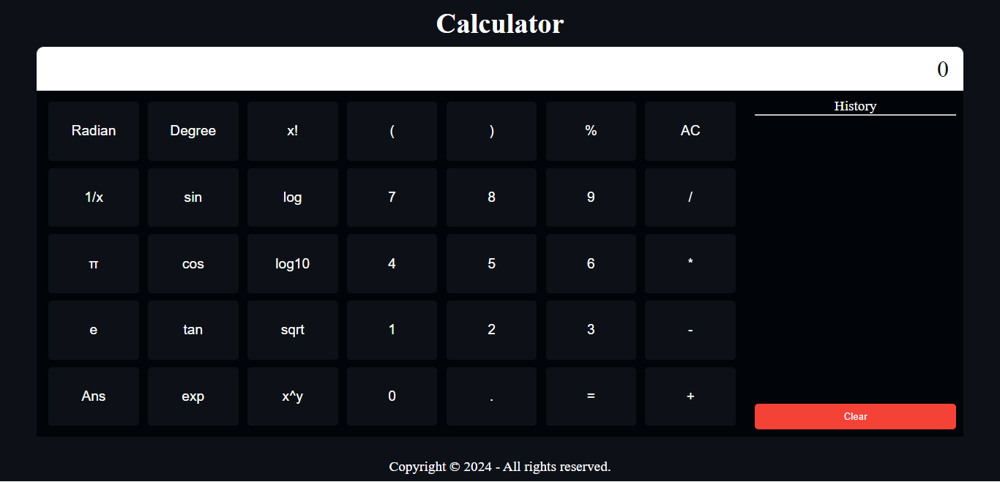

## Calculator

A simple and responsive calculator web application built using HTML, CSS, and JavaScript.

### Features

- Basic arithmetic operations: addition, subtraction, multiplication, and division.
- Trigonometric functions: sine, cosine, and tangent.
- Exponential and logarithmic functions.
- Factorial calculation.
- Memory function to store and recall previous results.
- Responsive design for seamless usage across various devices.

### Usage

- Enter numerical values and perform calculations using the buttons provided.
- Use the memory function to store and recall previous results.
- The calculator supports keyboard input for convenience.

### Contributing

Contributions are welcome! Feel free to open issues and pull requests for bug fixes, improvements, or new features.

